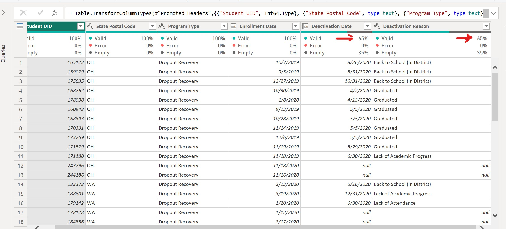
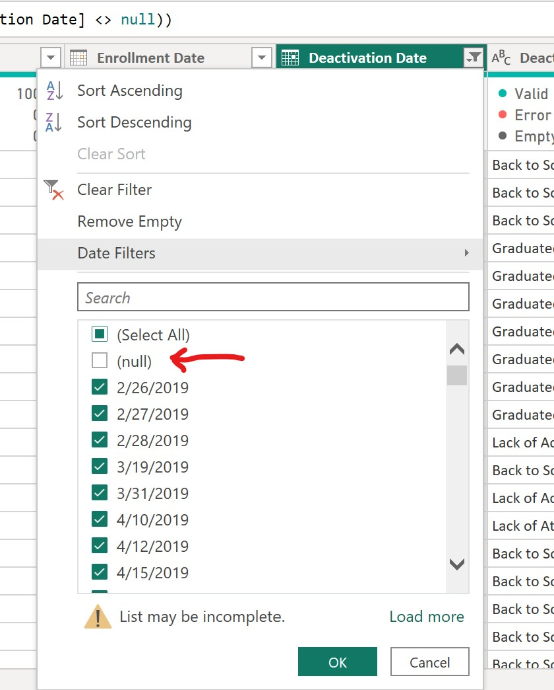
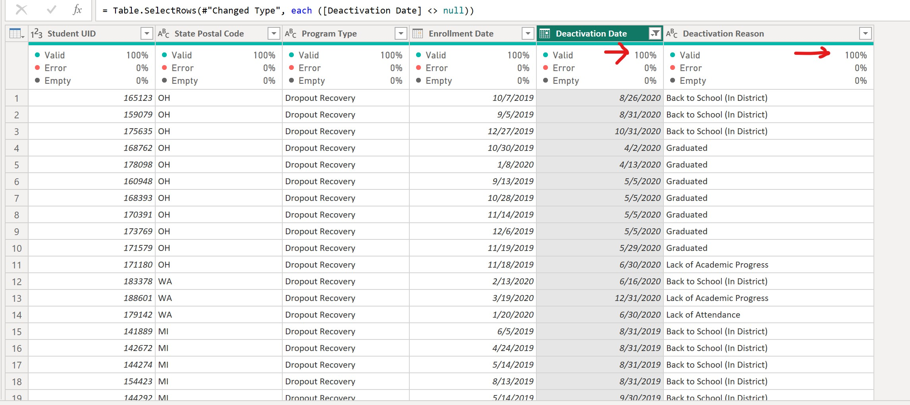
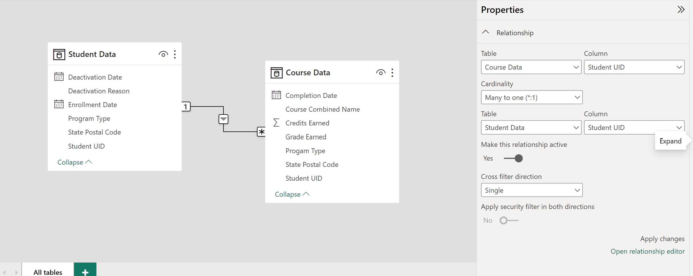

# Education Ministry Project
## Introduction
The Ministry of Education plays a pivotal role in shaping the future of a country by inculcating an educated and skilled citizenry. Its efforts gear to the development of a well-rounded, knowledgeable population capable of contributing to the social, economic, and cultural growth and progress of the nation.
They generate data on various aspects of the education system, such as enrollment rates, dropout rates, academic performance, and a lot more. 
This project was done using a Power BI desktop for the Analysis, Modelling and Visualization.
## About the dataset
The dataset contains 2 tables, in CSV format:
•	The Student Data table contains information on all 7,784 students from a Ministry of Education in the three States; Ohio, Washington and Michigan.
Each record represents one student, and contains about their studentUID, postal code, program type, enrollment date, deactivation date and deactivation reason.
•	The Course Data table contains complementary information about the students courses such as the course name, credit earned, grade earned and completion date.

## Project Description
In this Module's Scenario, I have been tasked by senior leadership of exams and records department of the school to create a suite of reports that are dependent on data store by HR in an excel document. The Goal of this project is to track students who dropped out of High school and are now Re-enrolled into the program. 

## Skills Demonstrated
The following Power BI was incoporated:
- Microsoft Power BI 
- Data Modelling
- DAX
- Explicit Measures
- Building Dashboard
- Problem Solving

## Problem Statement
1. Monthly Student Enrollments by State
2. Monthly graduates - by state
3. Monthly credits earned - by state
4. Any other insights in the data you think might be useful.
## Data Extraction 
The dataset (in csv) was extracted and loaded into the Power BI desktop. This was further transformed to view the anomalies and view missing values in the dataset 

## Data Cleaning
The transformed dateset was cleaned by removing the null (empty) values so that data integrity was ensured to give a robust analysis. This can be seen below at the deactivation date and deactivation reason gave 100% valid compared to 65% of dirty data.
The null values was unchecked by clicking and hover the cursor on the filter funnel of the ‘Deactivation Date’ column.

Dirty student Data                 | Null values                             | Cleaned student Data
:---------------------------------:|:---------------------------------------:|:--------------------------------:
        |                                    |

## Data Modelling
The created relatioship established within the data for quick measures and calculations. The cardinality generated is many to one, having single as cross filter direction. 

## Data Analysis Expression (DAX) and Measures.
Based on some certain calculations which were not implicitly calculated by Power BI. I calculated some measures using DAX to give summary of KPI’s and visualize them for data driven decisions. Some of the measures that were explicitly calculated were:
Grades A, B and C categories, total course entries, course program type, total credit earned e.t.c

## Dashboard
The visuals of the analysis is shown below which provided answers to the problem statement:

## Conclusion
Most students were enrolled in the second quarter (June) of the year. This period is the time where most of the courses in Michigan State (MI) open their applications for the new intake, which contributed to the higher graduation rate of students in the the beginning of the new year (depending on the course of study). 

For the Washington State (WA), their massive enrollment takes place in the first two months of the year (January and February) and July having the lowest number of enrolled students, likewise in the Michigan State (MI). They have most of their graduates in the beginning of the year as well. They run more of the yearly enrollment basis.  
The number of enrolled students in Ohio State (OH) is the lowest, as it is expected to have the least monthly graduate in all the three states. This means that Ohio has the least dropout students.
Dropout recovery constitutes 99.78% of the total course entries by program type, compared to less down 1% of other program types. This tells more about the re-engagement of dropout students back into the educational system. This speaks more on the effort the Government is taking to prioritize education especially to the dropouts. The analysis shows that the course entries program type is mostly for dropout recovery, it translates to the highest number of dropouts been admitted into the course programs. 
In terms of Credit Earned by States, WA has the highest credits, it is almost as double as MI followed by OH, which has the least credits earned.

## Recommendations
1.	The states like WA and MI should find out and emulate what OH state is doing differently to curb the reasons for their lowest rate of dropouts
2.	The government should continue to orientate citizens, especially the younger people on the importance of education for the benefit of individuals and society as a whole.
3.	The reasons for dropout such as ‘back to school’, lack of attendance, lack of academic progress e.t.c should be addressed, and it is advisable that the government to give stipend to the dropouts after their enrollment, so that they could be motivated and face their studies squarely.

